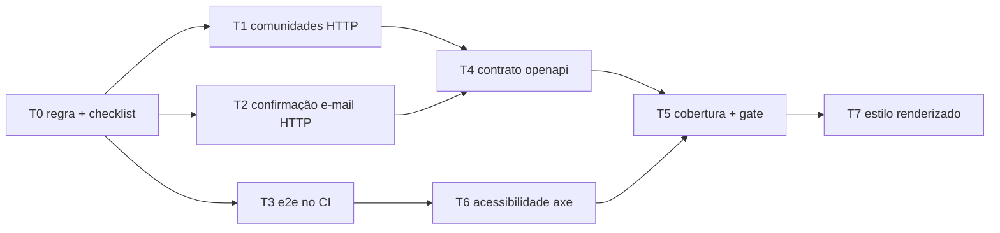

# Decisão: fechar as lacunas de teste e impedir que voltem

- **Data:** 2026-09-27
- **Estado:** aceita
- **Base:** `main` @ `a12d7d6` (depois do #31)
- **Escopo:** backend, frontend, CI, docs
- **Arquitetura:** detalha a AD-4 (validação da resposta contra o contrato) e o RNF06 (WCAG 2.2 AA). Nenhuma AD muda.

## Contexto

Em 2026-09-27 a bateria tinha cerca de 470 testes: 98 no backend (JUnit), 336 no frontend (Vitest) e 36 e2e (Playwright). O CI roda o backend, o frontend e o lint do `openapi.yaml`. O levantamento encontrou estas lacunas:

1. Nenhuma das 6 rotas de `/comunidades` é testada pelo HTTP real. O `ComunidadeService` tem teste unitário, mas o status HTTP, o JSON, o `JwtSecurityFilter` e o envelope de erro dessas rotas não são verificados.
2. `POST /auth/confirmacao-email/{token}` e `/reenvio` só têm teste no service. O fluxo cadastro → e-mail → confirmação → login nunca roda inteiro.
3. Os e2e não rodam no CI. Só um deles usa o backend real, e só com `E2E_BACKEND=1`.
4. Nenhum teste compara as respostas com o `openapi.yaml`, apesar de a AD-4 prever isso.
5. Não há medida de cobertura: nem JaCoCo, nem coverage no Vitest.
6. Não há teste de acessibilidade automatizado, apesar de o RNF06 exigir WCAG 2.2 AA.
7. Os testes visuais de `ui/` e de `styles/` leem o texto do SCSS, não o estilo renderizado (o jsdom não calcula CSS).
8. O checklist de `como-funciona.md` cita `AuthResourceTest` como exemplo de `@QuarkusTest`, mas ele é unitário, com mocks.

## Decisão

### Regra: qualidade não vira dívida técnica

Uma funcionalidade só está pronta quando tem os testes da tabela abaixo. O revisor do PR confere.

| Mudança | Testes obrigatórios |
|---|---|
| Regra de negócio (`*Service`) | Unitário cobrindo o caminho feliz e cada `ApiException` que o método lança |
| Endpoint novo ou alterado (`*Resource`) | `@QuarkusTest` pelo HTTP: caminho feliz, 401 sem token (se a rota não for pública) e um caso para cada código de erro que a rota devolve. A resposta é validada contra o `openapi.yaml` (T4) |
| Tela nova | Vitest da tela (formulário, chamadas HTTP, estados de erro e sucesso) e um e2e do caminho principal com checagem de acessibilidade (T6) |
| Componente de `ui/` | Vitest e, depois do T7, teste do estilo renderizado |
| Qualquer PR | A cobertura medida não pode cair (T5) |

**Exceção.** Um teste só fica para depois quando for estritamente necessário. Isso vale quando a ferramenta ainda não existe no projeto (ex.: antes do T7) ou quando o teste depende de algo externo que não roda no CI (ex.: SMTP real). Nesses casos, o PR registra um item em [`../dividas-tecnicas.md`](../dividas-tecnicas.md) com o motivo e o PR ou evento que remove a exceção. "Não deu tempo" não é motivo.

### Plano: 7 PRs

A ordem fecha primeiro os buracos que escondem bug hoje (T1, T2). Depois o contrato (T4) aproveita esses testes, e o gate de cobertura (T5) entra com a linha de base já mais alta.

| PR | Conteúdo | Lacuna | Estado |
|---|---|---|---|
| T0 | Esta decisão; regra acima no checklist de `como-funciona.md` e no `AGENTS.md`; exemplo de `@QuarkusTest` corrigido para `AutenticacaoFluxoTest` | 8 | Concluído (#32) |
| T1 | `@QuarkusTest` de `/comunidades` | 1 | Em andamento |
| T2 | `@QuarkusTest` da confirmação de e-mail e do fluxo cadastro → login | 2 | Pendente |
| T3 | Job E2E no CI (mockado) e job E2E com backend real | 3 | Pendente |
| T4 | Validação de toda resposta dos `@QuarkusTest` contra o `openapi.yaml` | 4 | Pendente |
| T5 | JaCoCo e coverage do Vitest, com gate que não deixa a cobertura cair | 5 | Pendente |
| T6 | `@axe-core/playwright` nos e2e das telas; checklist manual em `docs/acessibilidade-checklist.md` | 6 | Em andamento (KAN-71): roda local; no CI quando o T3 entrar |
| T7 | Vitest em modo browser para `ui/` e `styles/` | 7 | Pendente |

### T1. Comunidades pelo HTTP

Uma classe `ComunidadeFluxoTest` (`@QuarkusTest`, rest-assured) em `comunidades/web/`, no padrão do `AutenticacaoFluxoTest`.

| Rota | Casos |
|---|---|
| todas | 401 sem token; 401 com token malformado |
| `POST /comunidades` | 201 com o criador como membro; 409 `COMUNIDADE_NOME_EM_USO`; 422 `CAMPO_OBRIGATORIO` (nome em branco) |
| `GET /comunidades` | Paginação (`pagina`, `tamanho`, `totalElements`); filtro por `tipo` e `nome`; 422 `TIPO_INVALIDO` (o 422 entrou no contrato junto com o T1) |
| `GET /comunidades/minhas` | Traz a comunidade de curso do auto-join e a recém-criada |
| `GET /comunidades/{id}` | 200 com `souMembro` verdadeiro e falso; 404 `COMUNIDADE_NAO_ENCONTRADA` |
| `POST /comunidades/{id}/membros` | 201; 409 `JA_E_MEMBRO`; 404; 403 `COMUNIDADE_TIPO_INVALIDO` (comunidade de curso) |
| `DELETE /comunidades/{id}/membros/me` | 204, e a comunidade some de `/minhas`. Sair da comunidade de curso hoje dá 204 e o aluno não consegue voltar: fica fora do T1 até a decisão do KAN-73 |

- **Helper de teste:** `UsuarioDeTeste` (em `src/test/.../compartilhado/`) cadastra um usuário com e-mail único, confirma o e-mail direto pelo `UsuarioRepository` e devolve o token de login. T2 reaproveita o helper.
- **Isolamento:** os `@QuarkusTest` compartilham o banco e as chamadas HTTP não voltam atrás com `@TestTransaction`. Cada teste usa nomes e e-mails com sufixo aleatório e nunca conta registros globais, só os que ele mesmo criou.

### T2. Confirmação de e-mail pelo HTTP

Uma classe `ConfirmacaoEmailFluxoTest` usa o `MockMailbox` do Quarkus para ler o link enviado.

- Cadastro → e-mail na caixa simulada → `POST /auth/confirmacao-email/{token}` 200 → login 200. É o fluxo completo que falta hoje.
- Login antes de confirmar → erro de e-mail não confirmado.
- Token inexistente → 404 `TOKEN_CONFIRMACAO_INVALIDO`.
- Token expirado (a expiração é ajustada pelo repositório) → 400 `TOKEN_CONFIRMACAO_EXPIRADO`.
- Confirmar duas vezes → idempotente.
- `/reenvio` → novo e-mail na caixa, e o token antigo deixa de valer (se for a regra; o teste documenta o comportamento atual).

O envio por SMTP real (DT-4) fica fora, porque depende de um provedor externo. É a exceção prevista na regra.

### T3. E2E no CI

- **Job `E2E` (mockado):** `npm ci`, `npx playwright install --with-deps chromium`, `npm run e2e`. Publica o `playwright-report/` como artefato quando falha. Entra como check obrigatório do PR.
- **Job `E2E backend`:** sobe o Quarkus em `%dev` (Dev Services usa o Docker do runner, como os `@QuarkusTest` já usam) e roda os e2e com `E2E_BACKEND=1`. No mesmo PR entram dois e2e novos com backend real: cadastro → confirmação (link lido do log ou de um endpoint de dev) → login, e entrar/sair de uma comunidade.

### T4. Contrato

- Um filtro do rest-assured é registrado globalmente para os `@QuarkusTest` e aponta para `../openapi.yaml`. Toda requisição e resposta dos testes de T1 e T2, e dos atuais, passa a ser validada contra o contrato.
- **Escolha da biblioteca:** o contrato é OpenAPI **3.1.0**, e o `swagger-request-validator-restassured` (Atlassian) só suporta 3.1 em parte. O PR começa com um teste curto: o validador precisa aceitar o `openapi.yaml` atual e reprovar uma resposta propositalmente errada. Se a Atlassian não passar, a alternativa é um filtro próprio e pequeno que pega o schema da operação no YAML e valida o corpo com `com.networknt:json-schema-validator` (que suporta JSON Schema 2020-12, o dialeto do 3.1). A escolha e o motivo ficam anotados no PR.
- Toda divergência encontrada é corrigida no mesmo PR, no código ou no contrato, conforme o que estiver certo.

### T5. Cobertura medida e gate

- **Backend:** extensão `quarkus-jacoco` (junta unitários e `@QuarkusTest`) e `jacoco-maven-plugin:check` com o mínimo de linhas e branches.
- **Frontend:** `@vitest/coverage-v8` e `ng test --coverage`, com `thresholds` no config do Vitest.
- **Gate:** o mínimo começa na cobertura medida neste PR, arredondada para baixo. Ele só sobe: quando um PR aumentar a cobertura, o PR seguinte pode subir o mínimo. Relatórios publicados como artefato do CI.

### T6. Acessibilidade

- `@axe-core/playwright` nos e2e de cada tela (login, cadastro, confirmar-email, feed, lista e detalhe de comunidades) e do shell, com as tags `wcag2a`, `wcag2aa`, `wcag21aa` e `wcag22aa`. Violação `serious` ou `critical` falha o teste.
- Ferramentas automáticas pegam só parte dos critérios da WCAG. Teclado, leitor de tela e ordem de foco continuam num checklist manual por tela. Essa é a exceção necessária, e ela fica escrita no checklist.

### T7. Estilo renderizado

- O Vitest passa a rodar em modo browser (opção `browsers` do builder `@angular/build:unit-test`, com Playwright) para os specs de `ui/` e `styles/`. Assim os testes medem o resultado com `getComputedStyle` (cor, borda, `:focus-visible`, estado desabilitado), e não o texto do SCSS.
- O `scss-guard.spec.ts` continua como está: ele verifica o código-fonte de propósito.
- Comparação por screenshot fica fora: ela muda com as fontes de cada sistema operacional e gera falso positivo no CI. Se o time quiser, vira uma decisão própria.

## Consequências

- **Tempo de CI:** sobe com os jobs de e2e (estimativa: alguns minutos). Os jobs rodam em paralelo com os atuais.
- **PR de funcionalidade:** fica maior, porque os testes da regra vão junto. Isso é intencional.
- **Checks obrigatórios:** passam de 3 para 5 (Frontend, Backend, Contrato, E2E, E2E backend). Configurar a proteção do branch `main` no GitHub depois do T3.
- **`dividas-tecnicas.md`:** passa a receber também as exceções de teste, com prazo.
