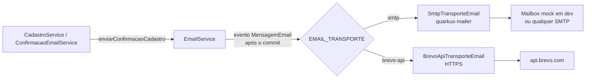

# Envio de e-mail: Brevo atrás de um transporte trocável por configuração

- **Data:** 01/10/2026
- **Resolve:** a parte de código da [DT-4](../dividas-tecnicas.md#dt-4-e-mail-de-confirmação-do-cadastro-não-chega-ao-usuário)

## Contexto

O cadastro chamava o `quarkus-mailer` direto, sem SMTP configurado: em dev o e-mail ficava na mailbox mock e em produção não saía. Sem o link de confirmação, o usuário não faz o primeiro login.

Restrições:

- O time não controla o DNS de nenhum domínio. Só serve um provedor que aceite um **remetente verificado** sem SPF/DKIM de domínio.
- O backend roda no **Render free**, que bloqueia SMTP de saída (portas 25/465/587). HTTPS passa.
- O provedor provavelmente vai mudar (domínio próprio, SMTP institucional, plano pago). A troca não pode exigir código.

## Decisão

1. **Provedor: Brevo**, plano grátis (300 e-mails/dia, sem prazo, remetente verificado sem domínio).
2. **`EmailService` delega a um `TransporteEmail`**, escolhido em runtime por `EMAIL_TRANSPORTE`:
   - `smtp` (padrão): `quarkus-mailer`, qualquer provedor SMTP só com `QUARKUS_MAILER_*`.
   - `brevo-api`: API HTTP da Brevo (`POST /v3/smtp/email`), para hospedagens que bloqueiam SMTP.
3. **Envio só depois do commit** (observer `AFTER_SUCCESS`). Cadastro desfeito não manda e-mail. Falha do provedor não desfaz o cadastro: vai para o log, e o usuário pede o reenvio na tela de cadastro (`POST /auth/confirmacao-email/reenvio`).
4. Valor inválido em `EMAIL_TRANSPORTE` derruba a subida, em vez de falhar no primeiro cadastro.

## Como trocar de provedor

| Cenário | Configuração (variáveis de ambiente) |
|---|---|
| Dev local (padrão) | nada: o e-mail aparece no log do `quarkus:dev` |
| Produção no Render free | `EMAIL_TRANSPORTE=brevo-api`, `BREVO_API_KEY`, `MAIL_FROM` (verificado na Brevo) |
| Hospedagem com SMTP liberado | `EMAIL_TRANSPORTE=smtp` + `QUARKUS_MAILER_HOST/PORT/USERNAME/PASSWORD/START_TLS` do provedor |
| Domínio próprio no futuro | só muda `MAIL_FROM` (e o provedor, se quiser) |

Um provedor só com API HTTP (sem SMTP), numa hospedagem que bloqueia SMTP, é o único caso que pede código: uma nova classe `TransporteEmail` com `@LookupIfProperty`. Os chamadores não mudam.

## Consequências

- Remetente verificado sem domínio próprio tem entrega pior. Pode cair no spam, principalmente em caixas institucionais. Registrar um domínio resolve, sem mudar código.
- A cota grátis (300/dia) cobre o PAC folgado. Testes locais não gastam cota, porque usam a mailbox mock.
