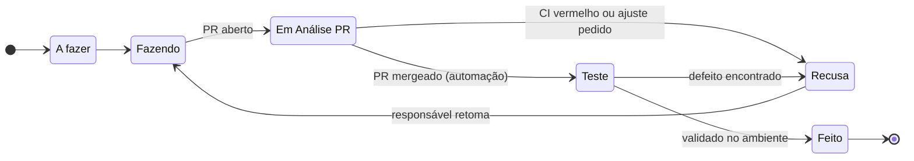

# Fluxo de status das tarefas no Jira

- **Data:** 02/10/2026
- **Status:** proposta, para o time aprovar

## Contexto

O projeto KAN tinha 6 status (A fazer, Fazendo, Em Análise, Revisão Merge, Teste, Feito), mas nenhum deles tinha uma definição escrita. "Em Análise" e "Revisão Merge" cobriam a mesma etapa (PR aberto esperando merge), com nomes diferentes, e cada pessoa usava do seu jeito. Na retro do épico 1, a KAN-18 ficou em "Em Análise" com o código já no `main` desde o PR #5 ([retro](../../_bmad-output/implementation-artifacts/epic-1-retro-2026-08-29.md)). Sem um combinado, o quadro não mostra o estado real das entregas. Também não dá para automatizar transições (ex.: PR mergeado → Teste) sem saber o que cada status significa.

## Decisão

| Status | Significa | Entra quando | Sai quando |
|---|---|---|---|
| **A fazer** | Priorizada, ninguém começou | A tarefa é criada ou puxada para a sprint | Alguém assume e começa |
| **Fazendo** | Em desenvolvimento, com responsável | O responsável começa, ou retoma uma tarefa em Recusa | O PR é aberto |
| **Em Análise PR** | PR aberto, esperando os 3 checks do CI e o merge | O PR com a chave `KAN-xx` é aberto | O PR é mergeado (→ Teste) ou é recusado (→ Recusa) |
| **Teste** | Código no `main`, falta validar funcionando | O PR é mergeado (automática, ver abaixo) | Validado (→ Feito) ou defeito encontrado (→ Recusa) |
| **Recusa** | Recusada no PR ou no Teste, esperando correção | O CI fica vermelho, a revisão pede mudança ou o Teste encontra defeito | O responsável retoma a correção (→ Fazendo) |
| **Feito** | Entregue e validado | O teste passa | — |

### Regras

- **Chave no PR:** todo PR leva a chave da tarefa (`KAN-xx`) no título, na branch ou nos commits. Sem a chave, nem a integração com o GitHub nem a automação encontram a tarefa.
- **Teste é validação funcional, não teste automatizado.** O teste automatizado já é parte da entrega e roda no CI antes do merge (`AGENTS.md`). Em Teste, alguém usa a funcionalidade de verdade no ambiente onde ela deve funcionar: em produção (Render) quando a tarefa depende de configuração do ambiente, como a KAN-49, ou local quando não depende.
- **Recusa sempre tem motivo:** quem recusa (no PR ou no Teste) move a tarefa para Recusa com um comentário dizendo o que precisa mudar. A tarefa fica visível no quadro como "voltou", em vez de se misturar com o que está em desenvolvimento pela primeira vez. Quando o responsável retoma, ela vai para Fazendo. Correção de defeito do Teste pode sair num PR novo na mesma tarefa.
- **Automação:** a regra "PR mergeado → Teste" do Jira faz a transição de Em Análise PR para Teste. Ela depende do app GitHub for Jira conectado ao repositório.

### Mudanças no quadro

- **"Em Análise" é renomeado para "Em Análise PR"**, deixando claro que é a etapa de PR aberto.
- **"Revisão Merge" é removido**, porque fazia o mesmo que Em Análise. As tarefas que estavam nele passam para Em Análise PR.
- **"Recusa" é criado** para as tarefas recusadas no PR ou no Teste.

## Consequências

- O quadro mostra onde cada entrega está: em código, esperando merge ou esperando validação.
- "Feito" passa a querer dizer "funciona", não só "mergeado". Isso evita repetir o caso da KAN-18 e o da DT-4, em que o código estava no `main` mas o e-mail não chegava em produção.
- Quem mergeia o PR (ou o responsável pela tarefa) precisa voltar à tarefa para validar. Sem isso, as tarefas se acumulam em Teste.
