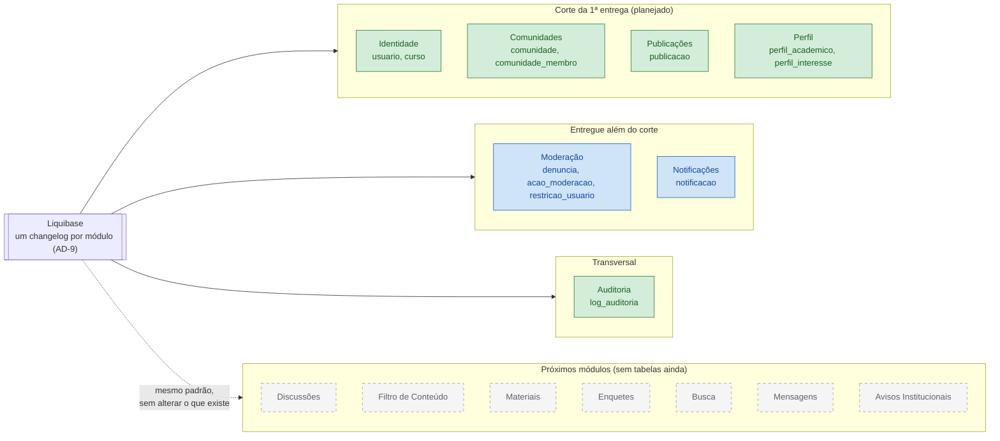

# Decisão: banco de dados construído junto com cada módulo

- **Data:** 2026-10-05
- **Estado:** aceita (formaliza o que já estava em AD-3 e AD-9)
- **Arquitetura (AD-1 a AD-11):** sem alteração

## Contexto

Uma das entregas cobradas é "banco completo + integração". Hoje o banco não cobre todos os módulos previstos: Discussões, Filtro de Conteúdo, Materiais, Enquetes, Busca, Mensagens e Avisos Institucionais ainda não têm tabelas. Este documento explica por que o banco está assim e por que isso não enfraquece a entrega.

## Decisão

As tabelas são criadas junto com a funcionalidade que as usa, nunca antes. Cada módulo ganha suas migrations Liquibase no mesmo PR que entrega o backend, o contrato e os testes daquele módulo.

## Justificativa

**1. Toda tabela que existe está em uso e testada.** Não há tabela vazia nem modelagem sem uso. Desenhar agora as tabelas de Enquetes, Mensagens ou Materiais seria adivinhar regras que ainda não validamos, e erro de modelagem custa caro de corrigir num banco que já está em produção. Materiais, por exemplo, ainda depende de escolher onde guardar arquivos (`arquitetura.md`, Deferred).

**2. O corte de escopo foi planejado.** A arquitetura definiu Identidade, Comunidades, Publicações e Perfil como o núcleo da primeira entrega. Os demais módulos foram adiados de propósito, para revisitar o escopo "depois que a fatia núcleo estiver no ar" (`arquitetura.md`, Deferred). Foi uma decisão tomada antes de começar, e não um atraso.

**3. Entregamos mais do que o corte previa.** Moderação e Notificações estavam fora da primeira entrega e já estão prontas, com banco, API, telas e testes. São 7 módulos com 12 tabelas criadas por migrations.

**4. Os próximos módulos entram sem retrabalho.** Cada módulo tem o próprio arquivo de migrations, com identificadores prefixados pelo nome do módulo (AD-9). O changelog mestre usa `includeAll` e não é editado, então dois PRs em paralelo não disputam o mesmo arquivo. Os módulos não compartilham chaves estrangeiras entre si (AD-3): um dado de outro módulo é referenciado só pelo id. Por isso, acrescentar Discussões ou Enquetes não altera nenhuma tabela que já existe.

**5. A qualidade é verificada a cada PR.**
- O CI roda 3 verificações: build e testes do backend, do frontend e do contrato.
- O contrato REST (`openapi.yaml`) é combinado antes de cada endpoint ser implementado (AD-4).
- O `ArquiteturaTest` impede que um módulo dependa da parte interna de outro.
- O schema de produção nunca é alterado manualmente (AD-9).

## Estado do banco

## Consequências

- "Banco completo" é medido pelo escopo entregue: todo módulo pronto tem o banco completo. O banco cresce junto com os próximos épicos.
- Cada módulo novo traz no próprio PR seu changelog `modulos/<modulo>/<modulo>-001-...xml`, seguindo o layout de [`como-funciona.md`](../como-funciona.md).
