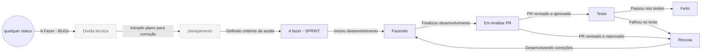

# Fluxo de status do Jira, revisado

- **Data:** 05/10/2026
- **Status:** em uso (workflow e quadro já ajustados no Jira)
- **Substitui:** [fluxo de 02/10](2026-10-02-fluxo-de-status-jira.md) (KAN-74)

## Contexto

O fluxo de 02/10 tinha 5 status e permitia voltar de Em Análise de PR ou de Teste direto para Fazendo. Na prática faltavam três coisas:

- **Recusa:** um lugar para o que foi reprovado no PR ou no teste. Sem ele, a volta para Fazendo apagava o motivo da recusa do quadro.
- **Preparação:** uma etapa antes de a tarefa entrar na sprint, para escrever os critérios de aceite.
- **Bugs e dívidas técnicas:** um destino para o que é achado no meio de outra tarefa, como o KAN-79, encontrado ao rodar o e2e do KAN-78.

O workflow também aceitava saltos (ex.: A fazer direto para Em Análise de PR). Assim, a tarefa podia chegar a Feito sem passar por Teste.

## Decisão

O workflow passa a ter 8 status e transições com nome, sem saltos.

Em tracejado, os status que ficam fora do quadro (ver "Quadro" abaixo).

| Status | Significa | Entra quando | Sai quando |
|---|---|---|---|
| **Divida técnica** | Bug ou dívida registrada, ainda sem plano | Alguém acha o problema, em qualquer status ("A Fazer - BUGs") | Começa o plano de correção (→ planejamento) |
| **planejamento** | Sendo detalhada: escopo e critérios de aceite | A tarefa é criada, ou sai de Divida técnica | Os critérios de aceite estão escritos (→ A fazer - SPRINT) |
| **A fazer - SPRINT** | Pronta e priorizada, ninguém começou | Os critérios de aceite foram definidos | Alguém começa (→ Fazendo) |
| **Fazendo** | Em desenvolvimento, com responsável | Começou, ou voltou de Recusa | O PR é aberto (→ Em Análise PR) |
| **Em Análise PR** | PR aberto, esperando revisão, CI e merge | O PR com a chave `KAN-xx` é aberto | Aprovado (→ Teste) ou reprovado (→ Recusa) |
| **Teste** | Código no `main`, falta validar funcionando | O PR foi aprovado e mergeado | Passou (→ Feito) ou falhou (→ Recusa) |
| **Recusa** | Reprovado no PR ou no teste, com o motivo em comentário | O PR ou o teste reprovou | Alguém começa a correção (→ Fazendo) |
| **Feito** | Entregue e validado | O teste passou | Só sai se virar bug (→ Divida técnica) |

### Regras

As regras de 02/10 continuam valendo: chave `KAN-xx` no PR, e Teste é validação funcional, não teste automatizado. Mudam ou entram estas:

- **Sem atalho para Feito.** Até uma tarefa criada depois da entrega (ex.: KAN-77, que mapeou a denúncia já mergeada) passa por Teste. Código mergeado sem teste manual registrado não está Feito.
- **Recusa sempre com comentário.** Quem reprova escreve o motivo e, se houver, o log ou o print. O KAN-77 é o exemplo: o comentário trouxe o log do erro, e a causa (sessão de 5 minutos) virou o KAN-78.
- **Problema achado no meio de outra tarefa vira ticket próprio** em Divida técnica, e não entra no PR da tarefa atual. Exemplo: o KAN-79 saiu do teste do KAN-78.
- **Responsável definido em A fazer - SPRINT.** Depois que a tarefa sai de A fazer, o responsável não muda. Num projeto *team-managed*, o Jira não bloqueia isso por status, então é um combinado do time. Se for preciso garantir, dá para usar uma automação que desfaz a troca.

### Quadro

O quadro mostra só o fluxo da sprint: **A fazer - SPRINT, Recusa, Fazendo, Em Análise PR, Teste e Feito**. **planejamento** e **Divida técnica** saíram do quadro, mas continuam existindo como status: os itens ficam no backlog e aparecem em filtros, por exemplo `project = KAN AND status in (planejamento, "Divida técnica")`.

## Consequências

- **Volta ao começo:** a tarefa reprovada passa por Recusa e depois por Fazendo, e não volta direto para o começo. O quadro mostra o que voltou e por quê.
- **Cliques a mais:** quem move tarefa pelo quadro ou pela API precisa seguir a ordem. Não dá mais para levar de A fazer até Feito numa transição só.
- **Automação de 02/10:** a regra "PR mergeado → Teste" foi escrita para o fluxo antigo. Ela precisa ser revista para usar a transição "PR Revisado e aprovado". Também falta confirmar se ainda está ativa.
- **Fora do quadro:** planejamento e dívida técnica ficam fora do dia a dia da sprint. Quem cuida do backlog precisa olhar esses itens com regularidade.
