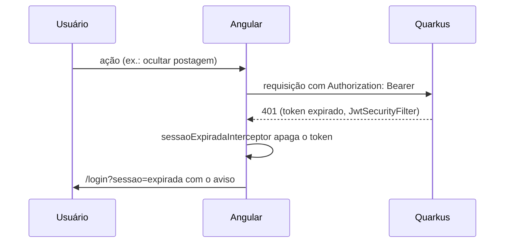

# Decisão: sessão de 8 horas e volta ao login quando expira

- **Data:** 2026-10-05
- **Estado:** aceita
- **Ticket:** KAN-78
- **Arquitetura (AD-1 a AD-11):** sem alteração. Complementa a AD-2: o token continua só no header `Authorization: Bearer`, com claims `sub` e `roles`.

## Contexto

No teste do KAN-77, o moderador clicou em "Ocultar postagem" alguns minutos depois de entrar e a ação falhou. O backend recusou o token com `SRJWT07000: Failed to verify a token`, porque ele já tinha expirado.

Duas falhas juntas causavam o problema:

1. **Backend:** `AuthService.autenticar` emitia o JWT sem definir a validade. Sem configuração, o SmallRye usa o padrão de 300 segundos, e toda sessão caía em 5 minutos.
2. **Frontend:** não havia tratamento de 401. O `authGuard` só conferia se existia token salvo, e não havia `HttpInterceptor` global. Depois de expirar, a tela continuava "logada" e toda ação falhava com mensagem genérica.

## Decisão

- **Validade de 8 horas**, configurável por `JWT_VALIDADE_HORAS` (`identidade.sessao.validade-horas`). Cobre um turno de aula ou de trabalho sem pedir login no meio, e limita a janela de um token vazado a um dia de uso.
- **Sem refresh token.** Depois de 8 horas o usuário entra de novo. Um refresh token pediria endpoint novo, armazenamento e revogação, e não se paga no tamanho atual do projeto.
- **`sessaoExpiradaInterceptor`**, o primeiro `HttpInterceptor` global do frontend: um 401 em chamada que levava `Authorization` apaga o token e leva para `/login?sessao=expirada`. O 401 do próprio login (credencial inválida) não leva o header e não é afetado. O erro segue para quem fez a chamada.
- **`authGuard`** passa a usar `AuthService.sessaoValida()`, que também confere a claim `exp`. Token vencido é apagado e a navegação vai para `/login?sessao=expirada`.
- **Tela de login** mostra "Sua sessão expirou. Entre novamente para continuar." (`role="status"`). O construtor também usa `sessaoValida()`, para não ficar em ciclo entre `/login` e `/feed` com um token vencido salvo.

## Consequências

- Os serviços continuam montando o header com `obterCabecalhoAutorizacao()`. O interceptor só trata a resposta e não adiciona o header: mover isso para ele seria outra mudança, fora deste ticket.
- Um token emitido antes deste deploy ainda vale só 5 minutos. Depois do deploy, quem estiver logado volta uma vez ao login.
