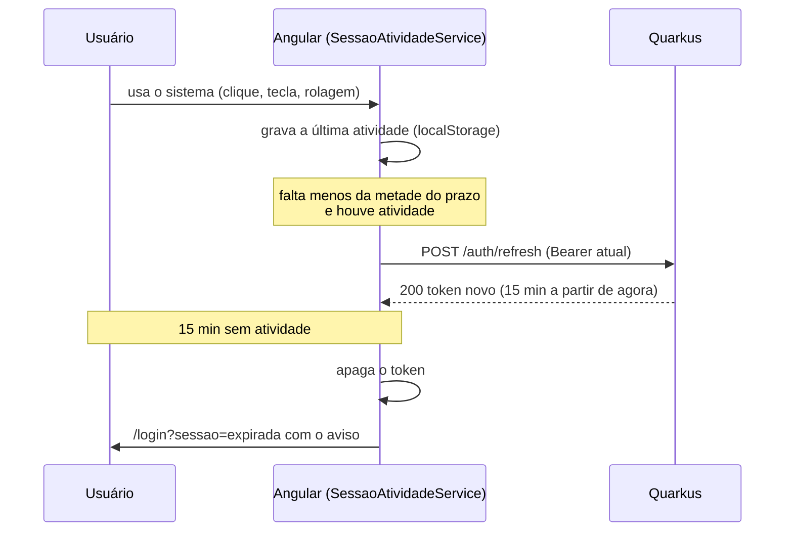

# Decisão: sessão expira por inatividade (15 minutos), com renovação do token

- **Data:** 2026-10-05
- **Estado:** aceita
- **Ticket:** KAN-78
- **Arquitetura (AD-1 a AD-11):** sem alteração. Complementa a AD-2: o token continua só no header `Authorization: Bearer`, com claims `sub` e `roles`, e o endpoint novo exige token válido como qualquer outro.

## Contexto

No teste do KAN-77, o moderador clicou em "Ocultar postagem" alguns minutos depois de entrar e a ação falhou. O backend recusou o token com `SRJWT07000: Failed to verify a token`, porque ele já tinha expirado.

Duas falhas juntas causavam o problema:

1. **Backend:** `AuthService.autenticar` emitia o JWT sem definir a validade. Sem configuração, o SmallRye usa o padrão de 300 segundos, e toda sessão caía em 5 minutos, mesmo com o usuário em uso.
2. **Frontend:** não havia tratamento de 401. O `authGuard` só conferia se existia token salvo, e não havia `HttpInterceptor` global. Depois de expirar, a tela continuava "logada" e toda ação falhava com mensagem genérica.

A primeira correção proposta foi um token fixo de 8 horas. Ela foi descartada por critério de segurança: uma tela aberta sem uso não deve continuar logada por muito tempo, para outra pessoa não usar a conta.

## Decisão

A sessão expira por **inatividade**:

- **15 minutos sem atividade**, configurável por `SESSAO_INATIVIDADE_MINUTOS` (`identidade.sessao.inatividade-minutos`). É o valor que o OWASP Session Management Cheat Sheet indica para aplicações de baixo risco (15 a 30 minutos; 2 a 5 só para alto risco). Cada token vale esse tempo.
- **`POST /auth/refresh`** troca o token atual, ainda válido, por um novo, com o prazo contado a partir de agora. Exige token válido (não entra na allowlist do `JwtSecurityFilter`), então token vencido ou anterior ao logout (`SessaoInvalidadaFilter`) não renova. O perfil (`roles`) do token novo vem do banco. Não há "refresh token" separado: o próprio token de sessão é renovado, o que dispensa armazenamento e revogação à parte.
- **`SessaoAtividadeService`** (frontend), iniciado pela casca autenticada (`Shell`):
  - Registra a atividade do usuário (ponteiro, tecla, rolagem, toque) no `localStorage`, para valer entre abas.
  - A cada 15 segundos, se falta menos da metade do prazo do token e houve atividade depois da emissão, chama o refresh.
  - Se passou o tempo de inatividade sem atividade em nenhuma aba, ou o token venceu, apaga o token e leva para `/login?sessao=expirada`, mesmo sem nenhuma requisição.
  - O tempo de inatividade vem do próprio token (`exp - iat`), sem repetir o número no frontend.
- **`sessaoExpiradaInterceptor`**, o primeiro `HttpInterceptor` global: um 401 em chamada que levava `Authorization` apaga o token e leva para `/login?sessao=expirada`. O 401 do login (credencial inválida) não leva o header e não é afetado.
- **`authGuard`** passa a usar `AuthService.sessaoValida()`, que também confere o `exp`. Token vencido é apagado e a navegação vai para `/login?sessao=expirada`.
- **Tela de login** mostra "Sua sessão expirou. Entre novamente para continuar." (`role="status"`).

## Consequências

- Não há limite absoluto de duração: um usuário ativo continua logado. O OWASP também recomenda um limite absoluto (algumas horas); fica como possível evolução, com uma claim de início da sessão preservada no refresh.
- Um token roubado pode ser renovado enquanto o atacante o usar. O logout continua invalidando todos os tokens anteriores (RF11), inclusive os renovados.
- O e2e com backend mockado não pode deixar chamada autenticada chegar a um backend real: com `quarkus:dev` rodando na 8080, a chamada sem mock recebe 401 e o interceptor manda para o login.
- Os serviços continuam montando o header com `obterCabecalhoAutorizacao()`. O interceptor só trata a resposta.
- Quem estiver logado no deploy volta uma vez ao login, porque os tokens antigos valem 5 minutos.
