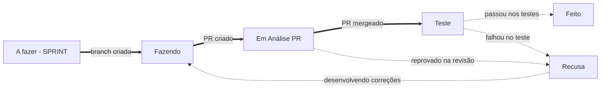

# Automação das transições do Jira pelo GitHub

- **Data:** 07/10/2026
- **Status:** decidida, falta configurar as regras no Jira
- **Complementa:** [fluxo de status revisado (05/10)](2026-10-05-fluxo-de-status-jira-revisado.md) e substitui a regra de automação do [fluxo de 02/10](2026-10-02-fluxo-de-status-jira.md)

## Contexto

O repositório foi integrado ao Jira pelo app GitHub for Jira. Com isso, o Jira recebe os eventos de branch, commit e PR que citam uma chave `KAN-xx`. Esses eventos podem disparar transições automáticas.

Hoje todas as transições são manuais. Isso tem custo: alguém precisa lembrar de mover o ticket quando começa a branch, quando abre o PR e quando faz o merge. Quando ninguém lembra, o quadro deixa de mostrar o estado real das entregas.

O fluxo de 02/10 previa uma regra "PR mergeado → Teste". O fluxo revisado de 05/10 trocou as transições, e essa regra ficou para ser revista. Esta decisão define quais regras usar no fluxo novo.

## Decisão

Três transições passam a ser automáticas, por regras de **Automação do Jira**. As demais continuam manuais, porque dependem de julgamento de alguém.

Linha grossa: automática. Linha tracejada: manual.

### Regras automáticas

| Gatilho (GitHub) | Condição: status atual | Transição | Status final |
|---|---|---|---|
| Branch criada | A fazer - SPRINT | Iniciou desenvolvimento | Fazendo |
| Pull request criado | Fazendo | Finalizou desenvolvimento | Em Análise PR |
| Pull request mergeado | Em Análise PR | PR Revisado e aprovado | Teste |

A condição de status é obrigatória em toda regra. Sem ela, uma branch nova para um ticket que já está em Teste, por exemplo para um ajuste, faria o ticket voltar para Fazendo.

### Transições que continuam manuais

- **Em Análise PR → Recusa:** o Jira não tem gatilho para o "changes requested" do GitHub. O "PR declined" só dispara quando o PR é fechado sem merge, e PR recusado continua aberto para correção. Quem revisa move o ticket e comenta o motivo, como no KAN-48.
- **Teste → Feito e Teste → Recusa:** dependem de alguém usar a funcionalidade de verdade (regra de 05/10: sem atalho para Feito).
- **Recusa → Fazendo:** quem retoma a correção move o ticket. Assim fica registrado que a correção começou.
- **Antes da sprint** (Divida técnica, planejamento, A fazer): dependem de escrever critérios de aceite, que é trabalho humano.

### Convenção que as regras exigem

A automação só acha o ticket se a chave estiver no evento:

- **Branch:** começa pela chave, ex.: `KAN-48-confirmar-senha`.
- **PR:** a chave no título, ex.: `feat(identidade): campo confirmar senha no cadastro (KAN-48)`.
- **Um ticket por PR.** Um PR que cita duas chaves move os dois tickets. Se a entrega é de fato conjunta, isso está certo. Se a segunda chave é só uma referência, ela vai no corpo do PR, não no título.

### Smart commits: não adotados

O GitHub for Jira também aceita comandos na mensagem de commit (`KAN-48 #comment ...`, ou a transição pelo nome com hífens). Não vamos usá-los, por dois motivos:

- Eles só funcionam se o e-mail do commit for o mesmo da conta no Jira, e no time esses e-mails não batem (e-mail pessoal ou do trabalho no git, e-mail `@catolicasc.edu.br` no Jira).
- O squash merge (AD-8) reescreve as mensagens. O comando pode rodar duas vezes, uma no commit da branch e outra no do `main`, ou se perder.

## Como configurar

Em **Configurações do espaço → Automação → Criar regra**, uma regra por linha da tabela:

1. **Gatilho:** o evento de desenvolvimento correspondente ("Branch criada", "Pull request criado" ou "Pull request mesclado").
2. **Condição:** "Status do item" igual ao status da tabela.
3. **Ação:** "Transicionar item" para o status final da tabela.
4. Nome da regra igual ao nome da transição (ex.: "Iniciou desenvolvimento (automático)"), para quem olhar o histórico do ticket entender de onde veio a mudança.

Também é preciso desativar a regra antiga "PR mergeado → Teste", se ela ainda existir, para não haver duas regras para o mesmo evento.

### Verificação

Depois de ativar as regras, na primeira tarefa da sprint:

- [ ] Criar a branch `KAN-xx-...` → o ticket vai de A fazer - SPRINT para Fazendo.
- [ ] Abrir o PR com `(KAN-xx)` no título → o ticket vai para Em Análise PR.
- [ ] Fazer o merge → o ticket vai para Teste.
- [ ] No log de auditoria de cada regra (em Automação), a execução aparece como "Sucesso". "Nenhuma ação" significa que a condição de status barrou a regra.

## Consequências

- **Menos cliques, quadro mais fiel:** o caminho feliz até Teste anda sozinho, e o quadro reflete o GitHub.
- **Ordem importa:** se alguém cria a branch antes de o ticket estar em A fazer - SPRINT, a regra não age (a condição barra). Nesse caso o ticket é movido à mão, e o certo é escrever os critérios de aceite antes de começar.
- **Limite do plano:** o plano gratuito do Jira limita as execuções de automação por mês. Com três regras e o volume atual do time, o limite deve bastar, mas é bom acompanhar no painel de uso da automação.
- **Responsabilidade de quem revisa:** como Recusa continua manual, quem reprova um PR precisa mover o ticket e comentar. Sem isso, o ticket fica parado em Em Análise PR.
