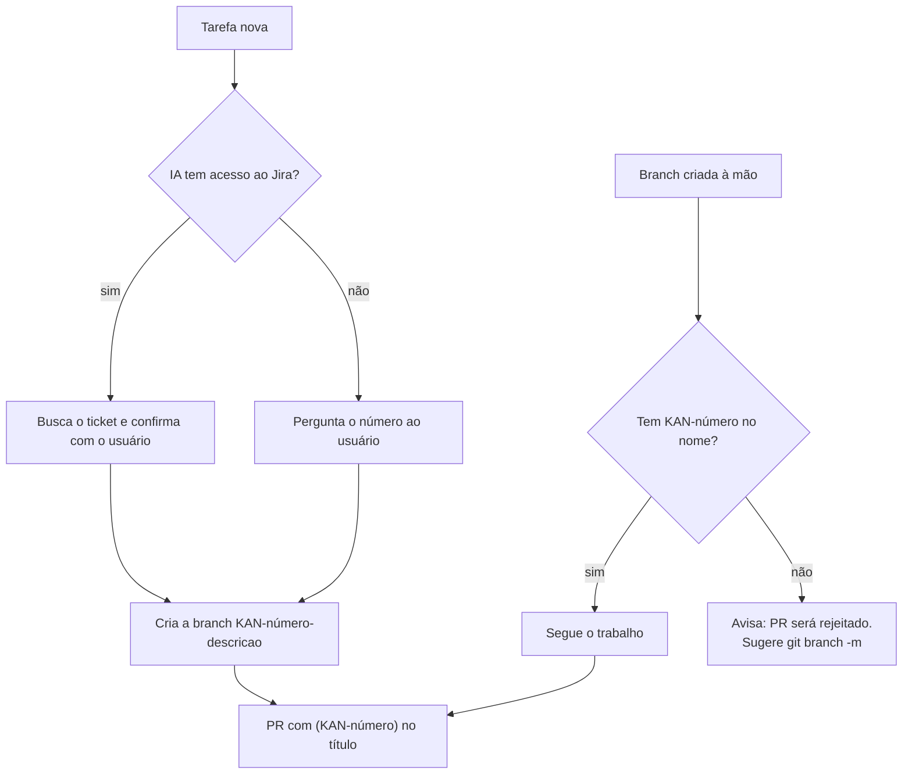

# Decisão: toda branch tem a chave do ticket no nome

- **Data:** 2026-10-08
- **Estado:** aceita
- **Ticket:** KAN-85
- **Arquitetura (AD-1 a AD-11):** sem alteração. Complementa a AD-8 (fluxo de PR) e a decisão de automação Jira↔GitHub de 07/10 (`2026-10-07-automacao-jira-github.md`)

## Contexto

O repositório está integrado ao Jira pelo app GitHub for Jira. O app só liga uma branch, os commits dela e o PR a um ticket quando encontra a chave `KAN-<número>` no evento. A decisão de 07/10 usa esses eventos para mover os tickets sozinha: branch criada leva o ticket para Fazendo, PR criado para Em Análise PR, PR mergeado para Teste.

Uma branch sem a chave quebra essa corrente. O ticket fica parado no quadro enquanto o código anda, a aba "Desenvolvimento" do ticket fica vazia, e quem revisa não sabe a qual critério de aceite o PR responde. Isso já aconteceu: o PR #19 (`feature/story-2-6-administracao-comunidade`) ficou semanas sem aparecer no KAN-26.

Parte do código do time é escrita com assistentes de IA (Claude Code e outros). Até aqui as regras para eles estavam só no `AGENTS.md`, e nenhuma pedia a chave na branch.

## Decisão

1. **Toda branch tem a chave do ticket no nome**, no começo: `KAN-<número>-<descricao-curta>` (ex.: `KAN-48-confirmar-senha`). O título do PR leva a chave no final, entre parênteses (ex.: `feat(identidade): campo confirmar senha no cadastro (KAN-48)`).
2. **PR de branch sem a chave é rejeitado na revisão**, com o pedido para recriar a branch com o nome certo. O ticket vai para Recusa como qualquer outra reprovação de PR.
3. **Regra para assistentes de IA**, no `CLAUDE.md` da raiz:
   - antes de criar a branch, a IA descobre o ticket: pela integração com o Jira, se tiver, ou perguntando o número ao usuário. Nunca inventa a chave;
   - se o usuário criou a branch manualmente sem a chave, a IA avisa que o PR será rejeitado e sugere renomear (`git branch -m`).

### Por que um `CLAUDE.md`

O Claude Code lê o `CLAUDE.md` da raiz automaticamente em toda sessão. O arquivo importa o `AGENTS.md` (`@AGENTS.md`), então as regras gerais continuam num lugar só, e o `CLAUDE.md` guarda apenas o que é específico de uso de IA. Outros assistentes que leem só o `AGENTS.md` seguem a mesma convenção pelo item 1 desta decisão, que vale para todo o time.

## Consequências

- **Integração confiável:** todo PR aparece no ticket certo, e as automações de 07/10 funcionam sem ajuste manual.
- **Custo pequeno:** é só escolher o nome da branch. Branch errada se corrige com `git branch -m` antes do push; depois do push, publicando a branch com o nome novo e abrindo o PR por ela.
- **Precisa de ticket antes do código.** Trabalho sem ticket (ex.: ajuste rápido de doc) passa a exigir um ticket, mesmo pequeno. É intencional: é o que mantém o quadro fiel ao repositório.
- **Branches antigas:** PRs já abertos sem a chave (hoje o #19 e o #56) não são reprovados retroativamente por isso; a regra vale para branches criadas a partir desta decisão.
- **Verificação humana:** não há check no CI para o nome da branch. Quem revisa o PR confere. Se o descuido se repetir, avaliar um check de nome de branch no `ci.yml`.
