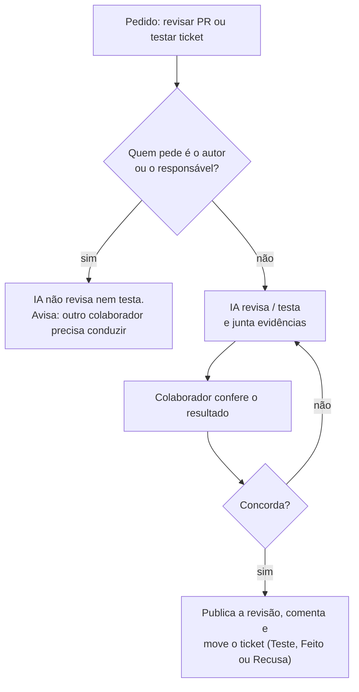

# Decisão: análise de PR e teste feitos por outro colaborador

- **Data:** 2026-10-08
- **Estado:** aceita
- **Ticket:** KAN-85
- **Arquitetura (AD-1 a AD-11):** sem alteração. Compatível com a AD-8: o merge continua exigindo só o CI verde, sem aprovação manual obrigatória no GitHub

## Contexto

O fluxo de status (decisão de 05/10) tem duas etapas de verificação depois do desenvolvimento: **Em Análise PR** (o PR é revisado) e **Teste** (a funcionalidade é usada de verdade no ambiente). Boa parte dessas verificações já é feita com assistente de IA: a IA lê o diff, roda o sistema, tira prints e escreve o parecer. Foi assim na recusa do KAN-41 e na revisão do PR #19 (KAN-26).

A IA facilita revisar o próprio trabalho: basta o autor pedir "revise meu PR" ou "teste meu ticket". Só que a verificação perde o valor quando quem verifica é quem fez. Quem escreveu o código tende a testar o caminho que já sabe que funciona e a aceitar o parecer sem questionar. O assistente também herda o mesmo ponto de vista, porque trabalha com o contexto e as premissas de quem pediu.

A AD-8 decidiu que não há revisão humana obrigatória para fazer merge, dado o prazo e o tamanho do time. Esta decisão não muda isso. Ela define **quem** conduz a análise e o teste quando eles acontecem.

## Decisão

1. **Análise de PR e teste são conduzidos por um colaborador diferente** do autor do PR e do responsável pelo ticket.
2. **A IA pode fazer o trabalho**: revisar o diff, rodar o sistema, coletar evidências e propor o veredito.
3. **O colaborador confere o resultado da IA** antes de agir: aprovar ou pedir alterações no PR, comentar no Jira, mover o ticket para Teste, Feito ou Recusa. Ele não é obrigado a refazer a revisão manualmente, mas responde pelo que publicar.
4. **Regra para assistentes de IA**, no `CLAUDE.md`:
   - antes de revisar ou testar, a IA compara o usuário da sessão com o responsável pelo ticket e com o autor do PR (conta do Jira e do GitHub; sem integração, pergunta);
   - se o usuário for o autor ou o responsável, a IA não faz a revisão nem o teste e avisa que outro colaborador precisa conduzi-los;
   - se for outro colaborador, a IA faz o trabalho e só publica a revisão, comenta ou move o ticket depois que ele confirmar.

## Consequências

- **Verificação independente** sem custo de revisão manual completa: a IA faz o trabalho pesado, e uma segunda pessoa confere e decide.
- **Responsável sempre identificado:** quem move o ticket para Teste, Feito ou Recusa é quem conferiu, e não quem desenvolveu.
- **Tickets podem esperar:** um ticket em Teste fica parado até outro colaborador pegá-lo. Hoje, por exemplo, KAN-77, KAN-78 e KAN-81 estão com o mesmo responsável e precisam de outra pessoa para o teste. Vale combinar na daily quem testa o quê.
- **Sem trava automática:** o GitHub já impede que o autor aprove o próprio PR, mas o Jira não impede que o responsável mova o próprio ticket. A regra depende da disciplina do time e do `CLAUDE.md` para os assistentes.
